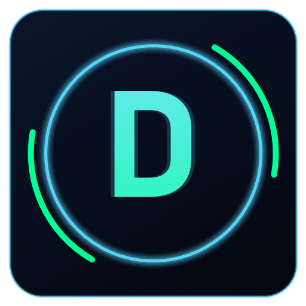
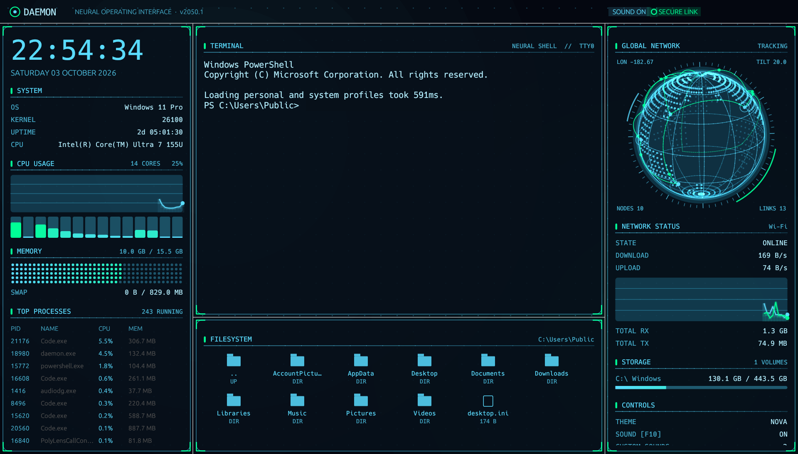
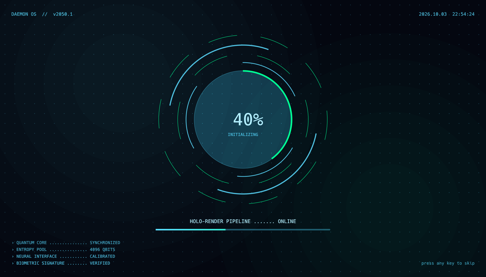
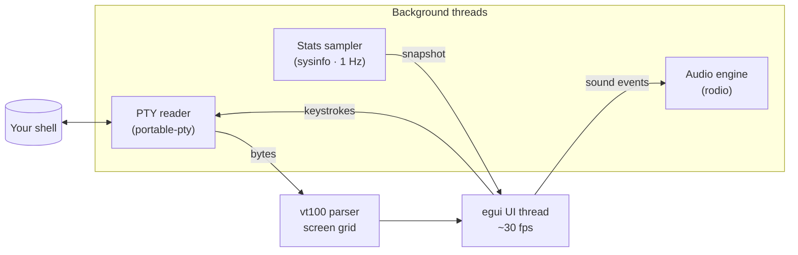

<div align="center">



# D A E M O N

### A holographic terminal and system monitor from the year 2050, written in Rust

[](https://www.rust-lang.org)
[](https://github.com/emilk/egui)
[](#-quick-start)
[](LICENSE)

**Native · ~8 MB binary · no Electron · no browser engine**



</div>

---

## ✦ What is DAEMON?

DAEMON turns your terminal into a sci-fi command center. A **real shell** sits in the middle,
surrounded by live telemetry from your machine: CPU cores, memory, processes, network traffic and
disks. A **holographic globe** spins in the corner, and every keystroke makes a quiet synthesized
sound.

It is inspired by the legendary [eDEX-UI](https://github.com/GitSquared/edex-ui), rebuilt from
scratch in Rust as a lightweight native app.

<div align="center">

<sub><i>The boot sequence: counter-rotating scanner rings, a progress arc and a subsystem log</i></sub>
</div>

---

## ✦ Features

<table>
<tr>
<td width="50%" valign="top">

### 🖥️ Real terminal
Your actual shell (PowerShell, zsh, bash…) running in a pseudo-terminal, with xterm-256color and
truecolor support, 5000 lines of scrollback and live resizing.

### 🌍 Holographic globe
A rotating 3D Earth with dotted continents, pulsing network nodes, data packets moving along
great-circle links, and a spinning HUD ring with a radar sweep.

### 🔊 Sci-fi sound design
Glassy keystroke ticks, an Enter pulse, boot pings, a power-up sweep and ambient data chatter,
all **synthesized in real time**. You can [replace any of them](#-custom-sounds) with your
own audio files.

</td>
<td width="50%" valign="top">

### 📊 Live telemetry
CPU usage graph with a bar per core, memory cell grid, swap, top processes, network up/down
graph, and storage for every disk.

### 🗂️ File browser
Click a folder to `cd` your shell into it. Click a file to type its path at the prompt.

### 🎨 2050 interface
Floating glass panels, glowing corner brackets, gradient graphs, a drifting dot-grid
backdrop, and seven color themes.

</td>
</tr>
</table>

---

## ✦ Quick start

> **Prerequisite:** [Rust](https://rustup.rs) (stable). The first build takes a few minutes.

```sh
git clone https://github.com/fcopensource/daemon.git
cd daemon
cargo run --release
```

<details>
<summary><b>🪟 Windows</b></summary>

Install Rust with [rustup-init.exe](https://rustup.rs). Then choose one of:

- **MSVC toolchain** (default): also install *Visual Studio C++ Build Tools* when prompted.
- **GNU toolchain** (no admin rights needed):
  ```powershell
  rustup-init.exe --default-host x86_64-pc-windows-gnu
  winget install BrechtSanders.WinLibs.POSIX.UCRT
  ```

The built app is `target\release\daemon.exe`, with the **D** icon embedded.
</details>

<details>
<summary><b>🍎 macOS</b></summary>

See the full step-by-step guide: **[RUNNING_ON_MAC.md](RUNNING_ON_MAC.md)**. It covers Xcode
tools, building a `DAEMON.app` for your Dock, and troubleshooting.
</details>

<details>
<summary><b>🐧 Linux</b></summary>

Install the system libraries for audio and windowing first (Debian/Ubuntu shown):

```sh
sudo apt install build-essential libasound2-dev libxkbcommon-dev libgl1-mesa-dev libx11-dev
```

Then `cargo run --release`.
</details>

---

## ✦ Controls

| Key | Action |
|-----|--------|
| <kbd>F10</kbd> | sound on / off |
| <kbd>F11</kbd> | fullscreen on / off |
| Mouse wheel over the terminal | scroll back through output |
| <kbd>Ctrl</kbd> + <kbd>C</kbd> | interrupt the running command |
| <kbd>Ctrl</kbd> + <kbd>V</kbd> (<kbd>Cmd</kbd> + <kbd>V</kbd> on Mac) | paste |
| Any key during boot | skip the boot sequence |

Every other key goes straight to your shell.

---

## ✦ Themes

```sh
cargo run --release -- --theme neon
```

| Theme | Look |
|-------|------|
| `nova` | **default**: icy cyan and neon green on deep navy |
| `neon` | ultraviolet and electric cyan |
| `solar` | warm amber and teal |
| `ice` | frosted white and blue |
| `crimson` | red alert |
| `tron` | the classic eDEX-UI palette |
| `matrix` | retro phosphor green with CRT scanlines |

---

## ✦ Custom sounds

Drop audio files (`.wav` `.ogg` `.mp3` `.flac`) into the **`sounds/`** folder to override the
built-in effects:

| File | Plays on |
|------|----------|
| `key.*` | every keystroke |
| `enter.*` | the Enter key |
| `boot.*` | each boot log line |
| `granted.*` | boot complete |
| `click.*` | clicking in the file browser |
| `chatter.*` | random ambient data bursts |
| `ambient.*` | **looping background track** |

Restart DAEMON, and **CONTROLS → CUSTOM SOUNDS** shows how many files it loaded. Details are in
[`sounds/README.md`](sounds/README.md).

---

## ✦ Configuration

| Flag | Environment variable | Meaning |
|------|----------------------|---------|
| `--theme <name>` | `DAEMON_THEME` | color theme |
| `--mute` | `DAEMON_MUTE` | start with sound off |
| `--fullscreen` | | start in fullscreen |
| | `DAEMON_SHELL` | shell to launch, e.g. `pwsh`, `cmd.exe`, `/bin/zsh` |

---

## ✦ How it works



| File | Responsibility |
|------|----------------|
| [`src/main.rs`](src/main.rs) | CLI flags, window and icon setup |
| [`src/app.rs`](src/app.rs) | Panel layout, boot sequence, input routing |
| [`src/terminal.rs`](src/terminal.rs) | PTY, escape-sequence parsing, terminal rendering, key mapping |
| [`src/globe.rs`](src/globe.rs) | The 3D globe: projection, continents, arcs, HUD ring |
| [`src/sound.rs`](src/sound.rs) | Sound synthesizer and custom-sound loader |
| [`src/stats.rs`](src/stats.rs) | System statistics sampler |
| [`src/files.rs`](src/files.rs) | File browser |
| [`src/widgets.rs`](src/widgets.rs) | Graphs, bars, glass backdrop, corner brackets |
| [`src/theme.rs`](src/theme.rs) | Color themes |

The shell, the stats sampler and the audio player each run on their own thread, so slow I/O
never stalls the 30 fps interface.

---

## ✦ Roadmap

- [ ] On-screen keyboard
- [ ] Multiple terminal tabs
- [ ] File browser that follows the shell's working directory
- [ ] Text selection and copy in the terminal
- [ ] Theme files (JSON)
- [ ] Prebuilt downloads for each platform

Contributions are welcome. Open an issue or a pull request.

---

## ✦ Credits & license

Inspired by [eDEX-UI](https://github.com/GitSquared/edex-ui) by GitSquared. DAEMON is an
independent Rust implementation and shares no code with it.

Released under the **[GNU GPL v3.0](LICENSE)**.

<div align="center">
<br>
<sub>━━━━━━━━━━━━━━ <b>NEURAL LINK ESTABLISHED</b> ━━━━━━━━━━━━━━</sub>
</div>
